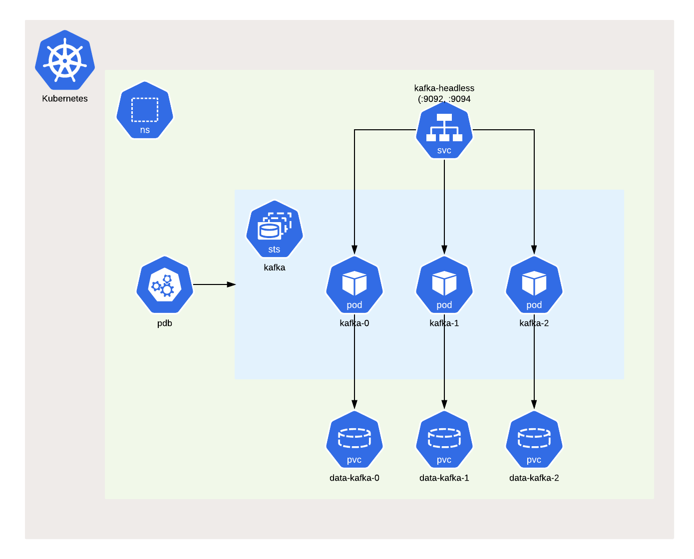

# kafka

A Helm chart for Confluent Kafka on Kubernetes

## Introduction

This chart bootstraps a [Kafka Cluster](https://kafka.apache.org) using the [Confluent](https://docs.confluent.io/home/kafka-intro.html) stable version.

[Kafka](https://kafka.apache.org) is an open-source distributed event streaming platform that:

- Publishes and subscribes to streams of records, similar to a message queue or enterprise messaging system.
- Stores streams of records in a fault-tolerant durable way.
- Processes streams of records as they occur.

## Developing Environment

| component                                                                      | version |
| ------------------------------------------------------------------------------ | ------- |
| [Podman](https://docs.podman.io/en/latest/)                                    | v4.3.1  |
| [Minikube](https://minikube.sigs.k8s.io/docs/)                                 | v1.28.0 |
| [Kubernetes](https://kubernetes.io)                                            | v1.25.3 |
| [Helm](https://helm.sh)                                                        | v3.10.2 |
| [Confluent Platform](https://docs.confluent.io/platform/current/overview.html) | v7.3.0  |

## Installing the Chart

Add the [chart repository](https://helm.sh/docs/helm/helm_repo_add/), if not done before:

```command
helm repo add rhcharts https://ricardo-aires.github.io/helm-charts/
```

To [install](https://helm.sh/docs/helm/helm_install/) the chart with the release name `kafka`:

```console
$ helm upgrade --install kafka rhcharts/kafka
Release "kafka" does not exist. Installing it now.
NAME: kafka
LAST DEPLOYED: Tue Nov 22 10:30:47 2022
NAMESPACE: default
STATUS: deployed
REVISION: 1
NOTES:
** Please be patient while the kafka chart is being deployed in release kafka **

This chart bootstraps a Kafka Cluster made of "3" brokers using the Confluent stable version that can be accessed from within your cluster:

    kafka-headless.default:9092

More info:
https://ricardo-aires.github.io/helm-charts/charts/kafka/
$
```

By default, it will also install the [zookeeper](https://github.com/ricardo-aires/helm-charts/tree/main/charts/zookeeper).

> If an external Zookeeper Ensemble is to be used turn `zookeeper.enabled` to `false` and include the `zookeeper.url`.

These commands deploy Kafka on the Kubernetes cluster in the default configuration. The [Parameters](#parameters) section lists the parameters that can be configured during installation.

The chart will create the next resources, by default:



1. A [PodDisruptionBudget](https://kubernetes.io/docs/concepts/workloads/pods/disruptions/) to ensure service availability during planned maintenance.
1. A [Headless Service](https://kubernetes.io/docs/concepts/services-networking/service/#headless-services) to control the internal listener for the Kafka.
1. A [StatefulSet](https://kubernetes.io/docs/concepts/workloads/controllers/statefulset/) which contains 3 Kafka Brokers [Pods](https://kubernetes.io/docs/concepts/workloads/pods/pod-overview/), by default.

One can run the:

- [helm list](https://helm.sh/docs/helm/helm_list/) command to list releases installed
- [helm status](https://helm.sh/docs/helm/helm_status/) to display the status of the named release
- [helm test](https://helm.sh/docs/helm/helm_test/) to run tests for a release

To [uninstall](https://helm.sh/docs/helm/helm_uninstall/) the `kafka` deployment run:

```console
helm uninstall kafka
```

The command removes all the Kubernetes components associated with the chart and deletes the release.

> Keep in mind that the [PersistentVolumeClaims](https://kubernetes.io/docs/concepts/storage/persistent-volumes/#persistentvolumeclaims) are in retain.

## Parameters

You can specify each parameter using the `--set key=value[,key=value]` argument to `helm install`.

Alternatively, a YAML file that specifies the values for the parameters can be provided while installing the chart. For example,

```console
helm upgrade --install kafka -f my-values.yaml rhcharts/kafka
```

A default [values.yaml](./values.yaml) is available and should be checked for more advanced usage.

### Image

By default the [confluentinc/cp-kafka](https://hub.docker.com/r/confluentinc/cp-kafka) is in use.

| Parameter          | Description                                   | Default                     |
| ------------------ | --------------------------------------------- | --------------------------- |
| `image.registry`   | Registry used to distribute the Docker Image. | `docker.io`                 |
| `image.repository` | Docker Image of Confluent Kafka.              | `confluentinc/cp-kafka` |
| `image.tag`        | Docker Image Tag of Confluent Kafka.          | `7.3.0`                     |

One can easily change the `image.tag` to use another version. When using a local/proxy docker registry we must change `image.registry` as well.

### Kafka Cluster

The configuration parameters in this section control the resources requested and utilized by the kafka chart.

| Parameter      | Description                  | Default |
| -------------- | ---------------------------- | ------- |
| `replicaCount` | The number of Kafka Brokers. | `3`     |

> The value for the [PodDisruptionBudget](https://kubernetes.io/docs/concepts/workloads/pods/disruptions/) is always `maxUnavailable` equals to `1`.

### Confluent Kafka Broker Configuration

The next configuration related to Kafka Broker are available:

| Parameter                       | Description                                                                                                                                     | Default                 |
| ------------------------------- | ----------------------------------------------------------------------------------------------------------------------------------------------- | ----------------------- |
| `autoCreateTopicsEnable`        | Enable auto creation of topic on the server.                                                                                                    | `false`                 |
| `deleteTopicEnable`             | Delete topic through the admin tool will have no effect if this config is turned off.                                                           | `true`                  |
| `offsetsTopicReplicationFactor` | The replication factor for the offsets topic.                                                                                                   | `3`                     |
| `numPartitions`                 | The default number of log partitions per topic.                                                                                                 | `3`                     |
| `defaultReplicationFactor`      | The default replication factors for automatically created topics.                                                                               | `3`                     |
| `minInsyncReplicas`             | The minimum number of replicas that must acknowledge a write for the write to be considered successful.                                         | `2`                     |
| `uncleanLeaderElectionEnable`   | Indicates whether to enable replicas not in the ISR set to be elected as leader as a last resort, even though doing so may result in data loss. | `false`                  |
| `logFlushIntervalMessages`      | The number of messages accumulated on a log partition before messages are flushed to disk                                                       | `10000`                 |
| `logFlushIntervalMs`            | The maximum time in ms that a message in any topic is kept in memory before flushed to disk.                                                    | `1000`                  |
| `logRetentionBytes`             | The maximum size of the log before deleting it.                                                                                                 | `1073741824`            |
| `logRetentionCheckIntervalMs`   | The frequency in milliseconds that the log cleaner checks whether any log is eligible for deletion.                                             | `300000`                |
| `logRetentionHours`             | The number of hours to eep a log file before deleting it (in hours).                                                                            | `168`                   |
| `logSegmentBytes`               | The maximum size of a single log file.                                                                                                          | `1073741824`            |
| `messageMaxBytes`               | The largest record batch size allowed by Kafka (after compression if compression is enabled).                                                   | `1048588`               |

More information can be found in the [Apache Kafka Documentation](https://kafka.apache.org/documentation/#brokerconfigs) and in the [Confluent Documentation](https://docs.confluent.io/platform/current/installation/configuration/broker-configs.html).

### Ports used by Kafka

For those still struggling with how the listeners work take a look at [Kafka Listeners - Explained](https://rmoff.net/2018/08/02/kafka-listeners-explained/) by [Robin Moffatt](https://twitter.com/rmoff/).

By default the [Headless Service](https://kubernetes.io/docs/concepts/services-networking/service/#headless-services) will expose the pods in the port `9092`, `port.kafkaInternal`, and one can use this headless service as a Bootstrap Server.

We have setup the possibility for external access by changing the next values:

```yaml
externalAccess:
  enabled: true
  initNodePort: 32400
## turn to support nodePort in docker desktop
isDocker: true
```

This will create a [nodeport service](https://kubernetes.io/docs/concepts/services-networking/service/#nodeport) that will expose each broker in a different port. So, if we have the `32400` as a start and we have `3` replicas we will have:

| pod       | map              |
| --------- | -----------------|
| `kafka-0` | `9094:32400/TCP` |
| `kafka-1` | `9094:32401/TCP` |
| `kafka-2` | `9094:32403/TCP` |

### Kerberos Authentication

This chart is prepared to enable [Kerberos authentication in Kafka](https://docs.confluent.io/platform/current/kafka/authentication_sasl/authentication_sasl_gssapi.html#brokers)

| Parameter               | Description                                | Default |
| ----------------------- | ------------------------------------------ | ------- |
| `kerberos.enabled`      | Boolean to control if Kerberos is enabled. | `false` |
| `kerberos.krb5Conf`     | Name of the [ConfigMap](https://kubernetes.io/docs/concepts/configuration/configmap/) that stores the `krb5.conf`, Kerberos [Configuration file](https://web.mit.edu/kerberos/krb5-1.12/doc/admin/conf_files/krb5_conf.html) | `nil`**¹** |
| `kerberos.keyTabSecret` | Name of the [Secret](https://kubernetes.io/docs/concepts/configuration/secret/) that stores the [Keytab](https://web.mit.edu/kerberos/krb5-1.19/doc/basic/keytab_def.html) | `nil`**¹** |
| `kerberos.jaasConf`     | Name of the [ConfigMap](https://kubernetes.io/docs/concepts/configuration/configmap/) that stores the JAAS configuration files per host.  | `nil`**¹** |
| `kerberos.testUserKeytabSecret` | Name of the [Secret](https://kubernetes.io/docs/concepts/configuration/secret/) that stores the [Keytab](https://web.mit.edu/kerberos/krb5-1.19/doc/basic/keytab_def.html) for the test user. Mandatory when `kerberos.testUser` is set | `nil` |

> **¹** When `kerberos.enabled` these parameters are required, and the [ConfigMap](https://kubernetes.io/docs/concepts/configuration/configmap/) and [Secret](https://kubernetes.io/docs/concepts/configuration/secret/) need to exist beforehand.

### Authorization Using ACLs

This chart is prepared to enable [Authorization using ACLs in Kafka](https://docs.confluent.io/platform/current/kafka/authorization.html) but doesn't manage ACLs.

> To enable ACLs, an authentication mechanism must also be enabled, e.g. Kerberos.

| Parameter      | Description                            | Default |
| -------------- | -------------------------------------- | ------- |
| `acls.enabled` | Boolean to control if ACLs are enabled | `false` |

### Data Persistence

The Kafka Kafka Data directory can be tweaked with:

| Parameter           | Description                                         | Default |
| ------------------- | --------------------------------------------------- | ------- |
| `data.storageClass` | Valid options: `nil`, `"-"`, or storage class name. | `nil`   |
| `data.storageSize`  | Size for data dir.                                  | `10Gi`  |

This will allow the creation of a [Persistent Volume](https://kubernetes.io/docs/concepts/storage/persistent-volumes/) using a specific [Storage Class](https://kubernetes.io/docs/concepts/storage/storage-classes/). However, [Access Mode](https://kubernetes.io/docs/concepts/storage/persistent-volumes/#access-modes).

### Resources for Containers

Regarding the management of [Resources for Containers](https://kubernetes.io/docs/concepts/configuration/manage-resources-containers/) the next defaults regarding requests and limits are set:

With this in mind the next defaults regarding resources and limits are set:

| Parameter                   | Description                                                             | Default  |
| --------------------------- | ----------------------------------------------------------------------- | -------- |
| `resources.limits.cpu`      | a container cannot use more CPU than the configured limit               | `1`      |
| `resources.limits.memory`   | a container cannot use more Memory than the configured limit            | `1400Mi` |
| `resources.requests.cpu`    | a container is guaranteed to be allocated as much CPU as it requests    | `250m`   |
| `resources.requests.memory` | a container is guaranteed to be allocated as much Memory as it requests | `512Mi`  |

In terms of the JVM the next default is set:

| Parameter  | Description                            | Default                                                     |
| ---------- | -------------------------------------- | ----------------------------------------------------------- |
| `heapOpts` | The JVM Heap Options for Kafka Broker. | `"-XX:MaxRAMPercentage=75.0 -XX:InitialRAMPercentage=50.0"` |

### Advance Configuration

Check the `values.yaml` for more advance configuration such as:

- [Liveness and Readiness Probes](https://kubernetes.io/docs/tasks/configure-pod-container/configure-liveness-readiness-startup-probes/#configure-probes)
- [Pod Security Context](https://kubernetes.io/docs/tasks/configure-pod-container/security-context/#set-the-security-context-for-a-pod)
- [Container Security Context](https://kubernetes.io/docs/tasks/configure-pod-container/security-context/#set-the-security-context-for-a-container)
