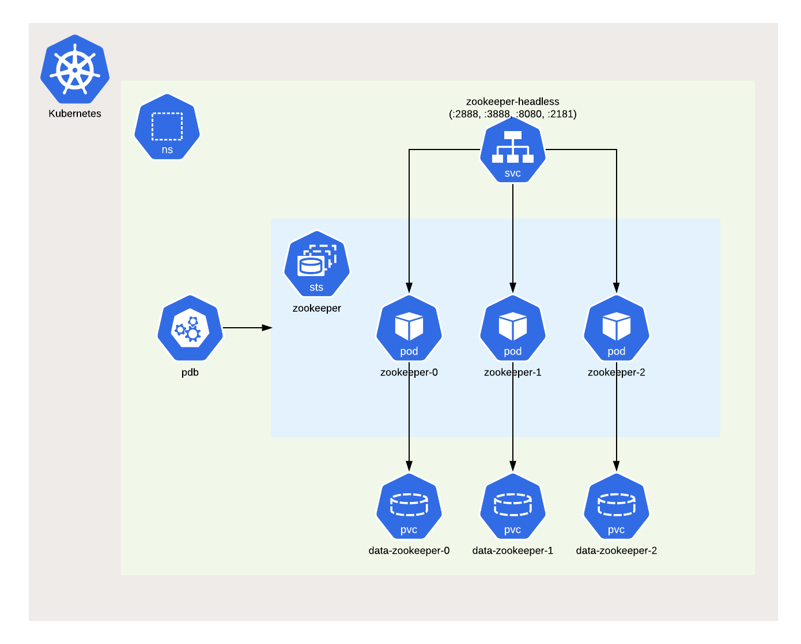

# zookeeper

A Helm chart for Confluent Zookeeper on Kubernetes

## Introduction

This chart bootstraps an ensemble [Apache Zookeeper](https://zookeeper.apache.org) Servers using the [Confluent](https://docs.confluent.io/platform/current/zookeeper/deployment.html) stable version.

[ZooKeeper](https://zookeeper.apache.org) is a centralized service for maintaining configuration information, naming, providing distributed synchronization, and providing group services, used as a backend by distributed applications.

## Developing Environment

| component                                                                      | version |
| ------------------------------------------------------------------------------ | ------- |
| [Podman](https://docs.podman.io/en/latest/)                                    | v4.3.1  |
| [Minikube](https://minikube.sigs.k8s.io/docs/)                                 | v1.28.0 |
| [Kubernetes](https://kubernetes.io)                                            | v1.25.3 |
| [Helm](https://helm.sh)                                                        | v3.10.2 |
| [Confluent Platform](https://docs.confluent.io/platform/current/overview.html) | v7.3.0  |
| [Zookeeper](https://zookeeper.apache.org/doc/r3.6.3/index.html)                | v3.6.3  |

## Installing the Chart

Add the [chart repository](https://helm.sh/docs/helm/helm_repo_add/), if not done before:

```shell
helm repo add rhcharts https://ricardo-aires.github.io/helm-charts/
```

To [install](https://helm.sh/docs/helm/helm_install/) the chart with the release name `zkp`:

```console
$ helm upgrade --install zkp rhcharts/zookeeper
Release "zkp" does not exist. Installing it now.
NAME: zkp
LAST DEPLOYED: Mon Nov 21 15:49:17 2022
NAMESPACE: default
STATUS: deployed
REVISION: 1
NOTES:
** Please be patient while the zookeeper chart is being deployed in release zkp **

This chart bootstraps an ensemble Apache Zookeeper Servers made of "3" servers using the Confluent stable version that can be accessed from within your cluster:

    zkp-zookeeper-headless.default:2181

To connect to your ZooKeeper server run the following commands:

    $ kubectl exec -it -n default zkp-zookeeper-0 -- zookeeper-shell zkp-zookeeper-headless.default:2181

More info:
https://ricardo-aires.github.io/helm-charts/charts/zookeeper/
$
```

This command deploy ZooKeeper on the Kubernetes cluster in the default configuration. The [Parameters](#parameters) section lists the parameters that can be configured during installation.

The chart will create the next resources:



1. A [PodDisruptionBudget](https://kubernetes.io/docs/concepts/workloads/pods/disruptions/) to ensure service availability during planned maintenance.
1. A [Headless Service](https://kubernetes.io/docs/concepts/services-networking/service/#headless-services) to control the network domain for the ZooKeeper processes  and to expose the [AdminServer](https://zookeeper.apache.org/doc/current/zookeeperAdmin.html#sc_adminserver_config).
1. A [StatefulSet](https://kubernetes.io/docs/concepts/workloads/controllers/statefulset/) which contains 3 Zookeeper [Pods](https://kubernetes.io/docs/concepts/workloads/pods/pod-overview/), by default.

One can run the:

- [helm list](https://helm.sh/docs/helm/helm_list/) command to list releases installed
- [helm status](https://helm.sh/docs/helm/helm_status/) to display the status of the named release
- [helm test](https://helm.sh/docs/helm/helm_test/) to run tests for a release

This chart uses the `srvr` command of the Zookeeper [Four Letter Words](https://zookeeper.apache.org/doc/r3.6.2/zookeeperAdmin.html#sc_4lw) to check that every Zookeeper Server is responding.

To [uninstall](https://helm.sh/docs/helm/helm_uninstall/) the `zkp` deployment run:

```console
helm uninstall zkp
```

The command removes all the Kubernetes components associated with the chart and deletes the release.

> Keep in mind that the [PersistentVolumeClaims](https://kubernetes.io/docs/concepts/storage/persistent-volumes/#persistentvolumeclaims) are in retain.

## Parameters

You can specify each parameter using the `--set key=value[,key=value]` argument to `helm install`.

Alternatively, a YAML file that specifies the values for the parameters can be provided while installing the chart. For example,

```console
helm upgrade --install zkp -f my-values.yaml rhcharts/zookeeper
```

A default [values.yaml](./values.yaml) is available and should be checked for more advanced usage.

### Image

By default the [confluentinc/cp-zookeeper](https://hub.docker.com/r/confluentinc/cp-zookeeper) is in use.

| Parameter          | Description                                   | Default                     |
| ------------------ | --------------------------------------------- | --------------------------- |
| `image.registry`   | Registry used to distribute the Docker Image. | `docker.io`                 |
| `image.repository` | Docker Image of Confluent Zookeeper.          | `confluentinc/cp-zookeeper` |
| `image.tag`        | Docker Image Tag of Confluent Zookeeper.      | `7.3.0`                     |

One can easily change the `image.tag` to use another version. When using a local/proxy docker registry we must change `image.registry` as well.

### Zookeeper Ensemble

The configuration parameters in this section control the resources requested and utilized by the zookeeper chart.

| Parameter      | Description                      | Default |
| -------------- | -------------------------------- | ------- |
| `replicaCount` | The number of ZooKeeper servers. | `3`     |

A minimum of three servers are required for a fault tolerant clustered setup, and it is strongly recommended that you have an odd number of servers, because Zookeeper requires a majority.

> The value for the [PodDisruptionBudget](https://kubernetes.io/docs/concepts/workloads/pods/disruptions/) is calculated automatically from the given `replicaCount`.

### Confluent Zookeeper Configuration

The next configuration related to Zookeeper are available:

| Parameter                   | Description                                                                                                             | Default               |
| --------------------------- | ----------------------------------------------------------------------------------------------------------------------- | --------------------- |
| `tickTime`                  | The length of a single tick, which is the basic time unit used by ZooKeeper, as measured in milliseconds.               | `2000`                |
| `initLimit`                 | Amount of time, in ticks (see `tickTime`), to allow followers to connect and sync to a leader.                          | `10`                  |
| `syncLimit`                 | Amount of time, in ticks (see `tickTime`), to allow followers to sync with ZooKeeper.                                   | `5`                   |
| `maxClientCnxns`            | Limits the number of concurrent connections that a single client may make to a single member of the ZooKeeper ensemble. | `60`                  |
| `autopurge.purgeInterval`   | The time interval in hours for which the purge task has to be triggered.                                                | `24`                  |
| `autopurge.snapRetainCount` | umber of most recent snapshots and the corresponding transaction logs in the dataDir and dataLogDir to keep.            | `3`                   |
| `quorumListenOnAllIPs`      | When set to true the ZooKeeper server will listen for connections from its peers on all available IP addresses          | `true`                |
| `maxSessionTimeout`         | The maximum session timeout in milliseconds that the server will allow the client to negotiate.                         | `40000`               |
| `adminEnableServer`         | Flag for the [AdminServer](https://zookeeper.apache.org/doc/current/zookeeperAdmin.html#sc_adminserver)                 | `true`                |
| `log4jRootLogLevel`         | Log level of ZooKeeper server                                                                                           |  `INFO`               |

More information can be found in the [Apache Zookeeper Documentation](https://zookeeper.apache.org/doc/current/zookeeperAdmin.html#sc_configuration) and in the [Confluent Documentation](https://docs.confluent.io/platform/current/zookeeper/deployment.html).

### Ports used by Zookeeper

ZooKeeper default ports:

| Parameter     | Description                                                                                      | Default |
| ------------- | ------------------------------------------------------------------------------------------------ | ------- |
| `port.peers`  | The port on which the ZooKeeper servers listen for requests from other servers in the ensemble.  | `2888`  |
| `port.leader` | The port on which the ZooKeeper servers perform leader election.                                 | `3888`  |
| `port.client` | The port to listen for client connections; that is, the port that clients attempt to connect to. | `2181`  |

Since 3.5.0 we may also set the [AdminServer](https://zookeeper.apache.org/doc/r3.6.1/zookeeperAdmin.html#sc_adminserver) which by default listens in the `8080` port but can be changed by setting the `port.admin` in the [AdminServer configuration](https://zookeeper.apache.org/doc/r3.6.1/zookeeperAdmin.html#sc_adminserver_config).

### Enable Kerberos

This chart is prepared to enable [Kerberos authentication in Zookeeper](https://docs.confluent.io/platform/current/security/zk-security.html#sasl-with-kerberos)

| Parameter               | Description                                | Default |
| ----------------------- | ------------------------------------------ | ------- |
| `kerberos.enabled`      | Boolean to control if Kerberos is enabled. | `false` |
| `kerberos.krb5Conf`     | Name of the [ConfigMap](https://kubernetes.io/docs/concepts/configuration/configmap/) that stores the `krb5.conf`, Kerberos [Configuration file](https://web.mit.edu/kerberos/krb5-1.12/doc/admin/conf_files/krb5_conf.html) | `nil`**¹** |
| `kerberos.keyTabSecret` | Name of the [Secret](https://kubernetes.io/docs/concepts/configuration/secret/) that stores the [Keytab](https://web.mit.edu/kerberos/krb5-1.19/doc/basic/keytab_def.html) | `nil`**¹** |
| `kerberos.jaasConf`     | Name of the [ConfigMap](https://kubernetes.io/docs/concepts/configuration/configmap/) that stores the JAAS configuration files per host.  | `nil`**¹** |

> **¹** When `kerberos.enabled` these parameters are required, and the [ConfigMap](https://kubernetes.io/docs/concepts/configuration/configmap/) and [Secret](https://kubernetes.io/docs/concepts/configuration/secret/) need to exist before.

### Data Persistence

The ZooKeeper server continually saves `znode` snapshot files in a Data Directory to enable you to recover data, transactional logs in this deployment are store in a separated directory.

| Parameter           | Description                                         | Default |
| ------------------- | --------------------------------------------------- | ------- |
| `data.storageClass` | Valid options: `nil`, `"-"`, or storage class name. | `nil`   |
| `data.storageSize`  | Size for data dir.                                  | `1Gi`   |

This will allow the creation of two [Persistent Volume](https://kubernetes.io/docs/concepts/storage/persistent-volumes/) using a specific [Storage Class](https://kubernetes.io/docs/concepts/storage/storage-classes/) and the same size for both.

### Resources for Containers

Regarding the management of [Resources for Containers](https://kubernetes.io/docs/concepts/configuration/manage-resources-containers/) the next defaults regarding resources and limits are set:

| Parameter                   | Description                                                             | Default |
| --------------------------- | ----------------------------------------------------------------------- | ------- |
| `resources.limits.cpu`      | a container cannot use more CPU than the configured limit               | `200m`  |
| `resources.limits.memory`   | a container cannot use more Memory than the configured limit            | `650Mi` |
| `resources.requests.cpu`    | a container is guaranteed to be allocated as much CPU as it requests    | `100m`   |
| `resources.requests.memory` | a container is guaranteed to be allocated as much Memory as it requests | `320Mi` |

In terms of the JVM the next default is set:

| Parameter  | Description                                | Default                                                     |
| ---------- | ------------------------------------------ | ----------------------------------------------------------- |
| `heapOpts` | The JVM Heap Options for Zookeeper Server. | `"-XX:MaxRAMPercentage=75.0 -XX:InitialRAMPercentage=50.0"` |

### Advance Configuration

Check the `values.yaml` for more advance configuration such as:

- [Liveness and Readiness Probes](https://kubernetes.io/docs/tasks/configure-pod-container/configure-liveness-readiness-startup-probes/#configure-probes)
- [Pod Security Context](https://kubernetes.io/docs/tasks/configure-pod-container/security-context/#set-the-security-context-for-a-pod)
- [Container Security Context](https://kubernetes.io/docs/tasks/configure-pod-container/security-context/#set-the-security-context-for-a-container)
